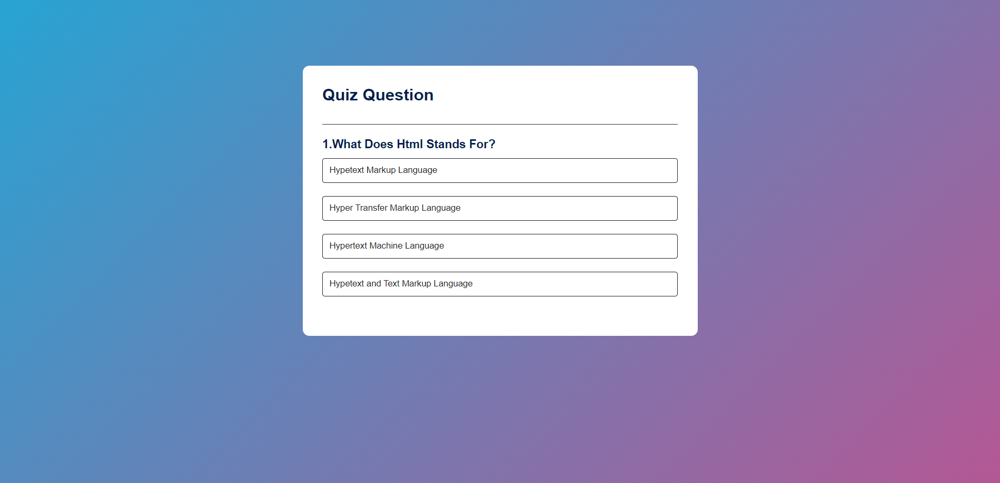

 ## Description

An interactive quiz application defines an array of questions, each with multiple answer choices and an indication of the correct answer. Functions are included to start the quiz, display each question, handle answer selection by updating the score and button styles, and show the final score. The quiz logic progresses through the questions, resetting the state as necessary and allowing users to retake the quiz.

# Screenshots

## Features
- Question Array
- Dynamic Question Display
- Answer Selection
- Score Tracking
- Next Question Button
- Quiz Completion
- Responsive UI

## Author

Akanksha Saraf

